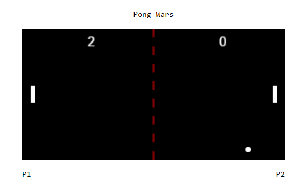

# Pong

*Site Screenshot*

###Software:
	

- Sublime Text (editing)
	

- Chrome (testing)
	

- GIT Bash (repo upload)

###Technologies Used
	

- html5, css3
, jquery, ES6
- keeping my codes clean, structured, and easy to read
	

- Used GIT Bash to push my local repo to Git Hub
	

- Validated index.html, style.css and reset.css

- Used Webpack in:
	- auto reloading my site on changes
	- compiling all the different .js files into one

- Learned how to use Object Oriented Programming

- Was able to use audio on certain events

###Stretched/Extra Goals
	

- None for now but will add in the future

###Future Goals
	

- To be able to write classes and to use them properly to build a game or an interactive part of my website
